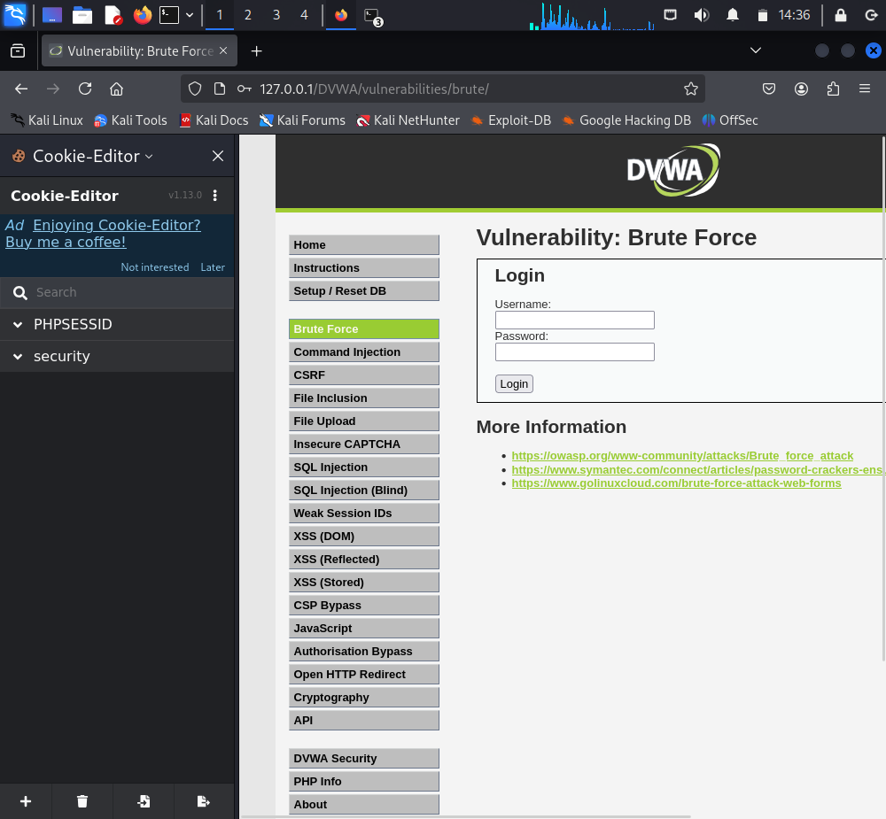

---
## Front matter
lang: ru-RU
title: Презентация по выполнению индивидуального проекта №3
subtitle: Основы информационной безопасности
author:
  - Беспутин Г.А.
institute:
  - Российский университет дружбы народов, Москва, Россия
date: 06 апреля 2025

## i18n babel
babel-lang: russian
babel-otherlangs: english

## Fonts
mainfont: PT Serif
romanfont: PT Serif
sansfont: PT Sans
monofont: PT Mono
mainfontoptions: Ligatures=TeX
romanfontoptions: Ligatures=TeX
sansfontoptions: Ligatures=TeX,Scale=MatchLowercase
monofontoptions: Scale=MatchLowercase,Scale=0.9

## Formatting pdf
toc: false
toc-title: Содержание
slide_level: 2
aspectratio: 169
section-titles: true
theme: metropolis
header-includes:
 - \metroset{progressbar=frametitle,sectionpage=progressbar,numbering=fraction}
 - '\makeatletter'
 - '\beamer@ignorenonframefalse'
 - '\makeatother'
---

# Информация

## Докладчик

:::::::::::::: {.columns align=center}
::: {.column width="70%"}

  * Беспутин Глеб Антонович
  * студентка группы НКАбд-01-23
  * Российский университет дружбы народов
  * <https://vk.com/yuri.kamori>

:::
::: {.column width="30%"}

:::
::::::::::::::

## Цель

Приобретение практических навыков по использованию инструмента Hydra для брутфорса паролей.

## Задание

1. Реализовать эксплуатацию уязвимости с помощью брутфорса паролей.

# Выполнение лабораторной работы

## Список паролей
 Чтобы пробрутфорсить пароль, нужно сначала найти большой список частоиспользуемых паролей. Его можно найти в открытых источниках, я взяла стандартный список паролей `rockyou.txt` для kali linux.

{#fig:001 width=70%}

## Параметры cookie

Захожу на сайт DVWA, полученный в ходе предыдущего этапа проекта. Для запроса hydra мне понадобятся параметры cookie с этого сайта.

Чтобы получить информацию о параметрах cookie я установила соответствующее расширение для браузера, теперь могу не только увидеть параметры cookie, но и скопировать их.

{#fig:003 width=70%}

## Запрос Hydra

Ввожу в Hydra запрос нужную информацию. Пароль будем подбирать для пользователя admin, используем GET-запрос с двумя параметрами cookie: безопасность и PHPSESSID, найденными в прошлом пункте. Спустя некоторое время в результат запроса появится результат с подходящим паролем.

{#fig:005 width=70%}

## Проверка результатов

Вводим полученные данные на сайт для проверки. Получаем положительный результат проверки пароля. Все сделано верно.

{#fig:007 width=70%}

## Вывод

Приобрела практические навыки по использованию инструмента Hydra для брутфорса паролей

:::

