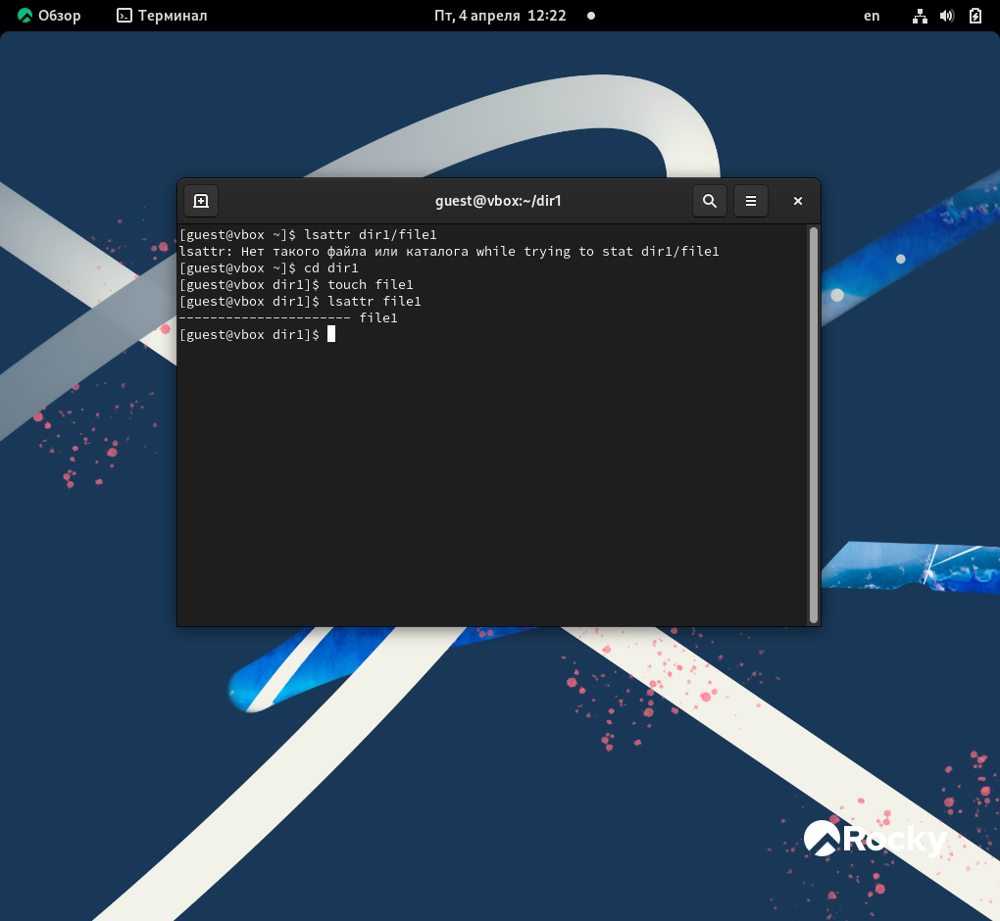
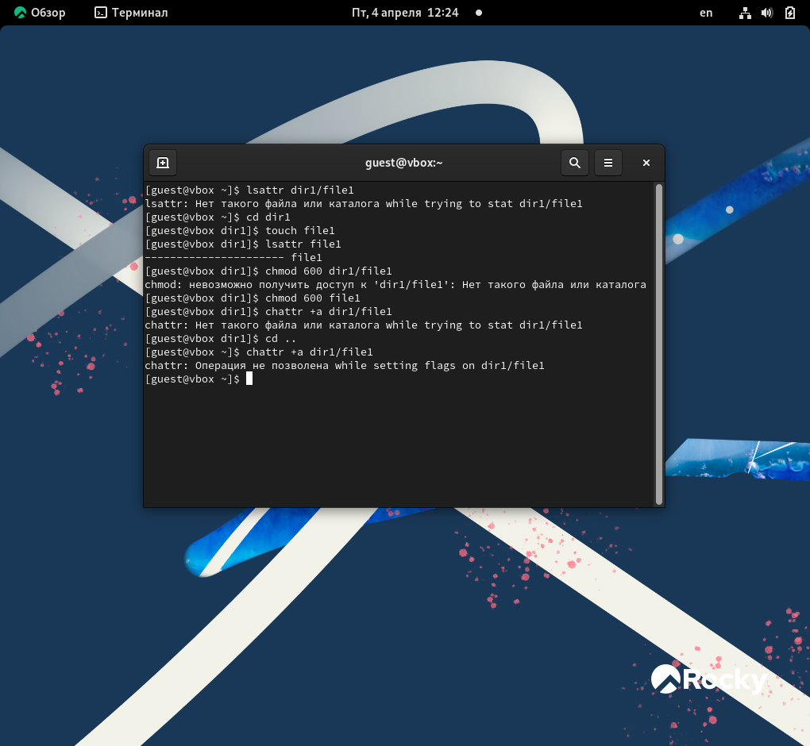
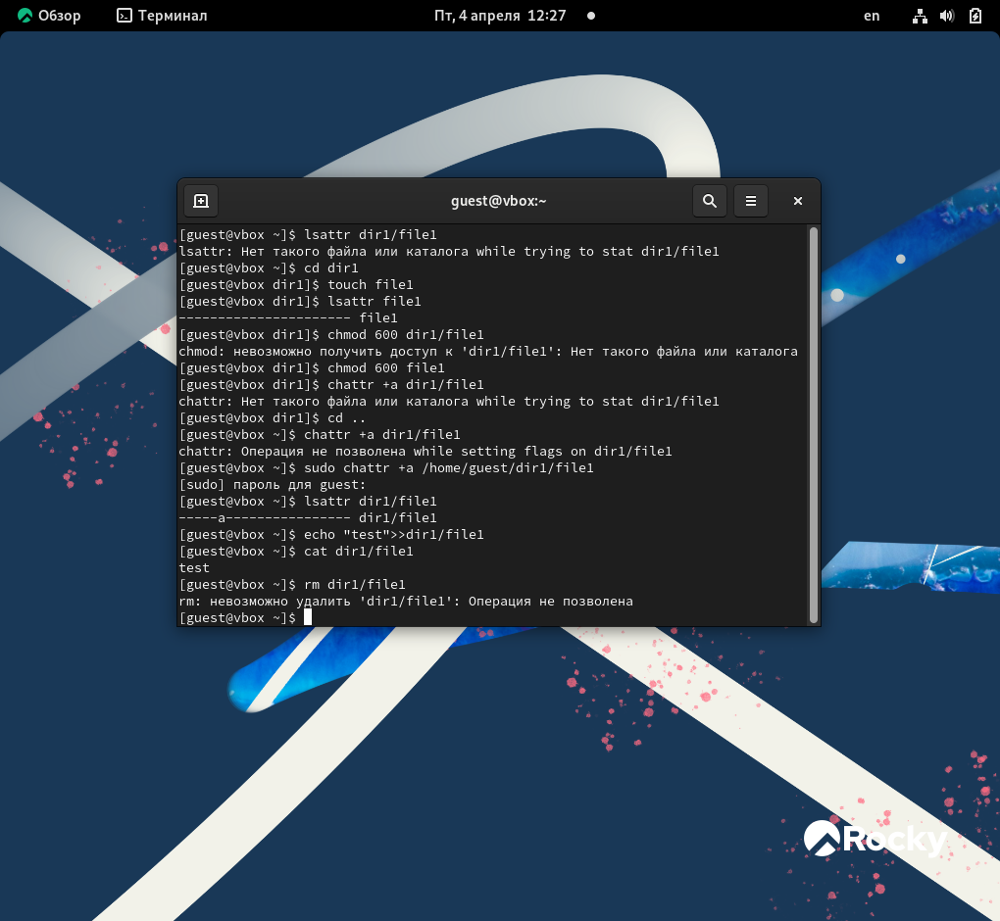
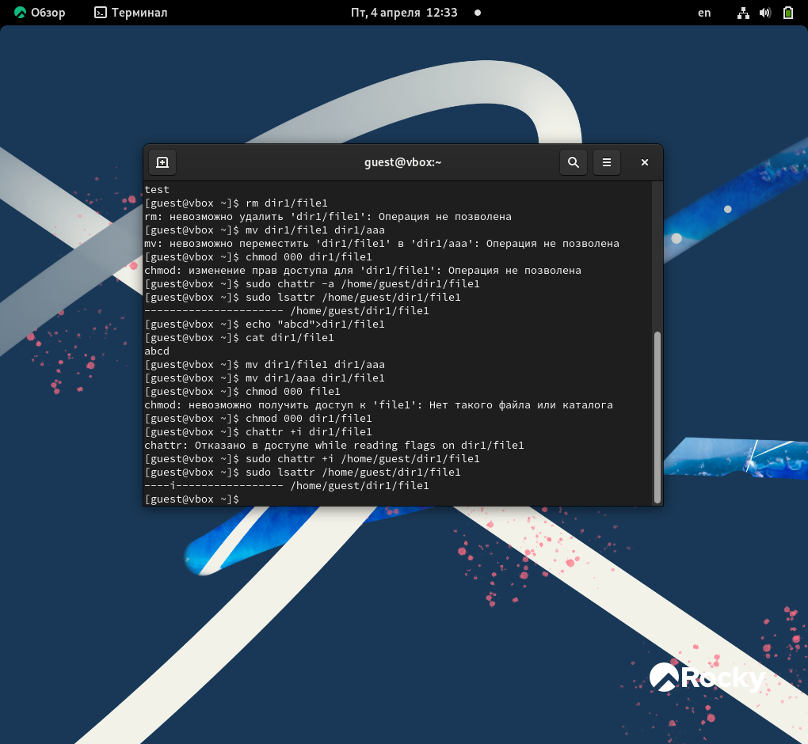

---
## Front matter
lang: ru-RU
title: Презентация по лабораторной работе №4
subtitle: Основы информационной безопасности
author:
  - Беспутин Г. А
institute:
  - Российский университет дружбы народов, Москва, Россия
date: 3 марта 2024

## i18n babel
babel-lang: russian
babel-otherlangs: english

## Fonts
mainfont: PT Serif
romanfont: PT Serif
sansfont: PT Sans
monofont: PT Mono
mainfontoptions: Ligatures=TeX
romanfontoptions: Ligatures=TeX
sansfontoptions: Ligatures=TeX,Scale=MatchLowercase
monofontoptions: Scale=MatchLowercase,Scale=0.9

## Formatting pdf
toc: false
toc-title: Содержание
slide_level: 2
aspectratio: 169
section-titles: true
theme: metropolis
header-includes:
 - \metroset{progressbar=frametitle,sectionpage=progressbar,numbering=fraction}
 - '\makeatletter'
 - '\makeatother'
---

# Информация

## Докладчик

:::::::::::::: {.columns align=center}
::: {.column width="70%"}

  * Беспутин Глеб Антонович
  * студентка группы НКАбд-01-23
  * Российский университет дружбы народов
  * <https://vk.com/yuri.kamori>

:::
::: {.column width="30%"}

:::
::::::::::::::

## Цель

Получение практических навыков работы в консоли с расширенными
атрибутами файлов

# Выполнение лабораторной работы

##
1. От имени пользователя guest, созданного в прошлых лабораторных работах, определяю расширенные атрибуты файлa `/home/guest/dir1/file1` (рис. 1).

{#fig:001 width=70%}

##

2. Изменяю права доступа для файла home/guest/dir1/file1 с помощью chmod 600 (рис. 2).

{#fig:002 width=70%}

##

3. Пробую установить на файл /home/guest/dir1/file1 расширен-
ный атрибут a от имени пользователя guest, в ответ получаю отказ от выполнения операции (рис. 3).

{#fig:003 width=70%}

##

4. Устанавливаю расширенные права уже от имени суперпользователя, теперь нет отказа от выполнения операции (рис. 4).

{#fig:004 width=70%}

##

5. От пользователя guest проверяю правильность установки атрибута (рис. 5).

{#fig:005 width=70%}

##

6. Выполняю **дозапись** в файл с помощью `echo 'test' >> dir1/file1`, далее выполняю чтение файла, убеждаюсь, что дозапись была выполнена (рис. 6).

{#fig:006 width=70%}

##

7. Пробую удалить файл, получаю отказ от выполнения действия.  (рис. 7).

{#fig:007 width=70%}

##

То же самое получаю при попытке переименовать файл(рис. 8).

{#fig:008 width=70%}

##

8. Получаю отказ от выполнения при попытке установить другие права доступа (рис. 9).

{#fig:009 width=70%}

##

9. Снимаю расширенные атрибуты с файла (рис. 10).

{#fig:010 width=70%}

##

Проверяю ранее не удавшиеся действия: чтение, переименование, изменение прав доступа. Теперь все из этого выполняется (рис. 11).

{#fig:011 width=70%}

##

10. Пытаюсь добавить расширенный атрибут i от имени пользователя guest, как и раньше, получаю отказ (рис. 12).

{#fig:012 width=70%}

##

Добавляю расширенный атрибут i от имени суперпользователя, теперь все выполнено верно (рис. 13).

##

{#fig:013 width=70%}

##

Пытаюсь записать в файл, дозаписать, переименовать или удалить, ничего из этого сделать нельзя (рис. 14).

{#fig:014 width=70%}

## Вывод

В результате выполнения работы вы повысили свои навыки использования интерфейса командой строки (CLI), познакомились на примерах с тем,
как используются основные и расширенные атрибуты при разграничении
доступа. Имели возможность связать теорию дискреционного разделения
доступа (дискреционная политика безопасности) с её реализацией на практике в ОС Linux. Опробовали действие на практике расширенных атрибутов «а» и «i»

:::

